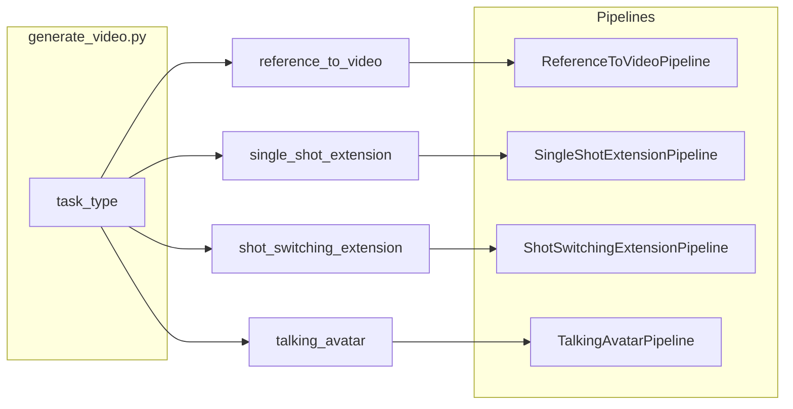

# SkyReels-V3 推理架构说明（中文）

本文档对照 **SkyReels-V3 Technique Report**（[arXiv:2601.17323](https://arxiv.org/abs/2601.17323)）与本仓库 **推理代码**，归纳统一多模态上下文生成框架，并为各核心路径给出 **模块职责说明** 与 **算法级伪代码**。训练数据管线、镜头检测器等仅在报告中描述、未包含在本仓库的部分会单独标明。

---

## 1. 总览

### 1.1 论文中的三条能力

| 报告章节 | 能力 | 本仓库入口 |
|---------|------|------------|
| §2.1 | 多参考图 → 视频（身份/构图一致性） | `--task_type reference_to_video` |
| §2.2 | 视频延展（单镜头连续 / 镜头切换） | `single_shot_extension` / `shot_switching_extension` |
| §2.3 | 音频驱动数字人 | `talking_avatar` |

### 1.2 推理入口与任务路由

主脚本：[`generate_video.py`](../generate_video.py)。

- **默认模型 ID**：`MODEL_ID_CONFIG` 按任务选择 Hugging Face 集合中的不同 checkpoint。
- **分布式**：`prepare_and_broadcast_inputs` 在 rank0 下载输入并将路径 `broadcast` 到各进程；`--use_usp` 时配合 xDiT 序列并行（见 §5）。

```text
parse_args()
resolve model_id (per task_type)
optional: download_model on rank0 + broadcast path
prepare_and_broadcast_inputs()   # 输入 URL/路径统一

switch task_type:
  reference_to_video     -> ReferenceToVideoPipeline.generate_video(...)
  single_shot_extension  -> SingleShotExtensionPipeline.extend_video(...)
  shot_switching_extension -> ShotSwitchingExtensionPipeline.extend_video(...)
  talking_avatar         -> preprocess_audio(...); TalkingAvatarPipeline.generate(...)

rank0: imageio.mimwrite(...) ; talking_avatar 可选 ffmpeg 合并音轨
```



---

## 2. 多参考图 → 视频（§2.1）

### 2.1 设计要点（论文 ↔ 代码）

- **条件构造**：每张参考 RGB 图经 **视频 VAE** 编码为 **单帧潜变量**，用数据集的 `latents_mean` / `latents_std` 归一化；最多 **4** 张图，在时间维 `concat`；不足 4 槽时用 **零潜变量** 填充到固定长度。
- **与噪声拼接**：目标视频的随机高斯潜变量 `latents` 与参考潜变量 `condition` 在 **通道维 `dim=2`** 上拼接后送入 DiT（见 `torch.cat([latents, condition], dim=2)`）。
- **Classifier-free guidance（双轴）**：
  - **文本**：正提示 vs `negative_prompt`。
  - **参考图**：保留参考 vs 将参考替换为 **全零张量** `uncondition`（图像无条件）。
  - 合成公式（与源码注释一致）：  
    `eps = eps_neg_txt_img + w_img * (eps_neg_txt - eps_neg_txt_img) + w_txt * (eps_cond - eps_neg_txt)`  
    其中只对 **生成段时间维** 的输出切片再做 scheduler 更新。

**核心文件**：

- [`skyreels_v3/pipelines/reference_to_video_pipeline.py`](../skyreels_v3/pipelines/reference_to_video_pipeline.py)：`WanSkyReelsA2WanT2VPipeline`、`prepare_latents`、去噪循环。
- [`skyreels_v3/modules/reference_to_video/transformer.py`](../skyreels_v3/modules/reference_to_video/transformer.py)：`SkyReelsA2WanI2v3DModel`；`WanAttnProcessor2_0` 中文本 token 与 **参考图 token** 分流的交叉注意力。

### 2.2 伪代码

```text
prompt_embeds, neg_embeds <- UMT5.encode(prompt, negative_prompt)

latents ~ N(0, I)   # shape [B, C, T_vid, H, W]
refs = []
for each ref_image in ref_imgs (max 4):
    z <- VAE.encode(ref_image as single-frame video)
    z <- (z - mean) * inv_std
    refs.append(z)
refs <- concat(refs, dim=T_latent); pad T_latent to 4 with zeros

for t in scheduler.timesteps:
    x <- concat(latents, refs, dim=channel)
    eps_cond      <- DiT(x, t, prompt_embeds)
    eps_neg_txt   <- DiT(x, t, neg_embeds)
    eps_neg_txt_img <- DiT(concat(latents, zeros_like(refs)), t, neg_embeds)
    eps <- combine_three_way(eps_cond, eps_neg_txt, eps_neg_txt_img, w_txt, w_img)
    eps <- eps[..., only_generated_temporal_span]
    latents <- scheduler.step(eps, t, latents)

pixels <- VAE.decode(denormalize(latents))
```

---

## 3. 视频延展（§2.2）

### 3.1 共用组件

- **VAE**：Wan 视频 VAE（如 `Wan2.1_VAE.pth`）。
- **文本**：任务侧 text encoder + `FlowUniPCMultistepScheduler`。
- **前缀**：从输入视频中取 **末尾 N 帧 RGB** 作为条件前缀（[`get_prefix_and_raw_video`](../skyreels_v3/utils/util.py)），再按分辨率桶缩放（[`ASPECT_RATIO_CONFIG`](../skyreels_v3/config.py)）。
- **报告中「镜头切换检测器」**：用于 **构建训练数据**，**不在本仓库推理路径中**。用户通过 prompt 中的标签（如 `[ZOOM_IN_CUT]`）表达转场意图，由模型在条件下生成。

### 3.2 单镜头延展（长时间滚动）

**类**：[`SingleShotExtensionPipeline`](../skyreels_v3/pipelines/single_shot_extension_pipeline.py)。

- 使用 `subfolder="transformer"`。
- 固定 **25** 帧作为每次生成的条件前缀；总时长按 **5 秒** 切块（`split_m_n(duration, 5)`）。
- 每一块的末尾 **25** 帧作为下一块的 `prefix_video`，实现 **自回归式长视频延展**；输出拼接时去掉重复的 25 帧前缀段。

```text
prefix <- last 25 frames of input video (bucket-resized)
chunks <- split total duration into segments of 5s (last chunk may be shorter)
all_frames <- []

for seg in chunks:
    cond <- VAE.encode(prefix)
    adjust latent temporal length for VAE alignment (padding / remainder)
    clip_rgb <- denoise(cond, seg, prompt, ...)
    all_frames.append(clip_rgb without first 25 frames)
    prefix <- last 25 frames of clip_rgb (normalized for next VAE.encode)

return concat(all_frames)
```

### 3.3 镜头切换延展（固定时长与条件帧映射）

**类**：[`ShotSwitchingExtensionPipeline`](../skyreels_v3/pipelines/shot_switching_extension_pipeline.py)。

- 使用 `subfolder="shot_transformer"`（与单镜头 **不同权重子目录**）。
- **`duration` 必须为 2–5 秒**，并与 **条件帧数** 一一对应（[`SHOT_NUM_CONDITION_FRAMES_MAP`](../skyreels_v3/config.py)）：例如 5 秒对应 **33** 帧前缀。
- **无外层滚动循环**：一次前向覆盖用户请求的（较短）延展片段。

```text
assert duration in {2,3,4,5}
N_cond <- SHOT_NUM_CONDITION_FRAMES_MAP[duration]
prefix <- last N_cond frames from input
cond <- VAE.encode(prefix)
frames <- denoise(cond, num_frames = duration * fps + 1, prompt, ...)
return frames
```

---

## 4. 音频驱动数字人（§2.3）

### 4.1 条件模态

**类**：[`TalkingAvatarPipeline`](../skyreels_v3/pipelines/talking_avatar_pipeline.py)，DiT：[`WanModel`](../skyreels_v3/modules/transformer_a2v.py)。

- **文本**：T5 三路编码——用户 `prompt`、负提示、`connection_prompt`（默认 “a person is talking”）。
- **图像**：CLIP 视觉特征；首帧肖像经桶选比例与 center crop。
- **音频**：**预计算** 的特征张量（[`preprocess_audio`](../skyreels_v3/utils/avatar_preprocess.py) 写入路径，在 `generate` 中 `torch.load`），而非原始波形直接进 DiT。
- **时空掩码 + VAE 条件**：对生成区域 mask，首段像素与 padding 拼接后 VAE 编码得到 `y`，与 mask 通道拼接后作为结构条件；论文中的 **关键帧 / 首尾帧约束** 在该管线中体现为 **mask 设计 + 滑窗衔接**。

### 4.2 长视频与 CFG

- **`frame_num`** 窗口、`motion_frame` / `drop_frame` 定义重叠；音频按中心索引取邻域帧特征。
- **CFG**：可同时调节 `text_guide_scale` 与 `audio_guide_scale`（四路预测组合，见源码 `arg_c` / `arg_null_text` / `arg_null_audio` / `arg_null`）。
- **多人场景**：报告提及 mask 指定说话人；**当前推理代码路径仅支持 `HUMAN_NUMBER == 1`**，多人分支会抛出错误。

### 4.3 伪代码（首段生成骨架）

```text
cond_image <- load portrait; bucket resize
audio_emb <- load(preprocessed tensor from preprocess_audio)
context, context_null, conn <- T5([prompt, neg_prompt, connection_prompt])
clip_fea <- CLIP(cond_image first frame)

build mask msk and padded pixel tensor -> VAE.encode -> y; concat(msk, y)
noise <- randn(latent_shape)

for timestep in euler_schedule:
    eps_cond <- WanModel(latent, t, context, clip_fea, audio, y, masks, ...)
    optionally eps_drop_text, eps_drop_audio, eps_full_null
    eps <- CFG_combine(eps_cond, ..., text_guide_scale, audio_guide_scale)
    latent <- latent + eps * dt

rgb <- VAE.decode(latent)
# 后续：滑窗、索引对齐、颜色匹配 process_video_samples 等见长视频分支
```

---

## 5. 工程：并行与显存

| 能力 | 说明 |
|------|------|
| **USP / `--use_usp`** | [`skyreels_v3/distributed/context_parallel_for_reference.py`](../skyreels_v3/distributed/context_parallel_for_reference.py)、`..._extension.py`、`..._avatar.py` 中对 attention / forward 打补丁，配合 `torchrun`。 |
| **`--offload` / `--low_vram`** | CPU offload、FP8 权重量化（talking_avatar / reference 等路径）以降低显存；与 USP 互斥约束见 CLI。 |

---

## 6. 术语与引用

- **In-context**：本仓库实现上体现为「在潜空间或像素空间拼接条件前缀 / 参考 / mask」，与报告中的统一多模态上下文叙述一致。
- **完整训练与数据细节**请以 [SkyReels-V3 Technique Report](https://arxiv.org/abs/2601.17323) 为准；本文仅覆盖 **开源推理仓库** 中可对照的部分。
